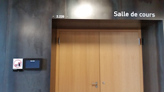
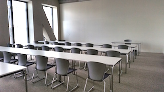

### Instructors

[Life Sciences Research Unit](http://wwwen.uni.lu/recherche/fstc/life_sciences_research_unit/)  
University of Luxembourg

- [Aurélien Ginolhac](mailto:aurelien.ginolhac@uni.lu)
- Eric Koncina

### Aim

Replace `R base` functions by the [**tidyverse**](https://barryrowlingson.github.io/hadleyverse/).
Adopt [Hadley Wickham](http://hadley.nz/) philosophy, take each step of data science and simplify the tools. 
Keeping what make them helpful and removing inconsistent and historic behaviors.

Summary in one picture, by [David Robinson](http://varianceexplained.org/)

```{r echo=FALSE, out.width='80%'}
knitr::include_graphics("http://lsru.github.io/r_workshop/img/drob_r_pipeline_600.jpg")
```


### Install tutorial

visit the [dedicated page](install_tutorial.html)

### Preliminary program

#### June 2nd morning, for complete beginner

##### Lecture ~ 45 minutes

- Slides: [online](lecture_day1-beginner.html) / [Rmd](lecture_day1-beginner.Rmd)

##### hands-on Rstudio

- Practical: [html](practical_day1-beginner.html) / [pdf](practical_day1-beginner.pdf)
- Practical _solution_: [html](practical_day1-beginner_solution.html) / [pdf](practical_day1-beginner_solution.pdf)

- practice on a small dataset
  + reading, specify locales and avoid factor conversions
- tidying data
  + transform wide / long format
  + detect and remove mistakes 
- plotting with `ggplot2`
  + introduction to the grammar of graphics
  + use aesthetics to map variables to columns
  + explore the world of `geom_*`
  + faceting for 1 or 2 variables

#### June 2nd afternoon, intermediate level

##### small presentation ~ 30 minutes - `dplyr`

- Slides: [online](lecture_day1-intermediate.html) / [Rmd](lecture_day1-intermediate.Rmd)

##### microarray hands-on

- Practical: [html](practical_day1-intermediate.html) / [pdf](practical_day1-intermediate.pdf)
- Practical _solution_: [html](practical_day1-intermediate_solution.html) / [pdf](practical_day1-intermediate_solution.pdf)

- public dataset of mRNA / mir from GEO using `bioconductor` package
- tidying data, split text
- merging annotation tables
- Fit linear models to mRNA/mir expression using `dplyr::do()`

#### June 3rd morning, advanced user

##### small presentation ~ 20 minutes

- Slides: [interactive shiny](http://shiny-server.uni.lu/lecture-advanced) / [html](lecture_day2-advanced.html) / [Rmd](lecture_day2-advanced.Rmd)

the _interactive_ version is accessible only inside the university network.

##### practical with yeast data.

- Practical: [online](practical_day2-advanced.html) 
- Practical _solution_: [online](practical_day2-advanced_solution.html) 

- tidying data
- performing thousands of linear regression
- tidying / ranking models using functional programming using `purrr` and nested data frames
- animate time series using `gganimate`
- viz comparison using `UpSetR`
- interactive input using embedded `shiny` in `rmarkdown`

### Practical information

Please, do bring **your laptop** as no computer will be available.
Everyone should have one according to the survey.

#### Schedule

-------------------------------------------------------
Day               Session           Start       End
----------------  ----------------  ----------  -------
June 2^nd^ 2016   Beginner          08:30        12:30

June 2^nd^ 2016   Intermediate      13:30       18:00

June 3^rd^ 2016   Advanced          08:00        12:15
-------------------------------------------------------

Hot & cold drinks will be served during the morning breaks.

#### Location

Campus Belval, [Maison du Savoir](http://wwwfr.uni.lu/contact/campus_de_belval)
in **Room 2.220**, second floor.



---

Inside



### About

Of note, all material was written in [**rmarkdown**](http://rmarkdown.rstudio.com/) (`.Rmd`) using **Rstudio**.

```{r echo=FALSE, out.width='60%'}
knitr::include_graphics("http://lsru.github.io/r_workshop/img/rmarkdown_600.png")
```

---

You can download the `Rmd` for each slides / practical by changing the extension.
For example [`lecture_day1-beginner.Rmd`](http://lsru.github.io/r_workshop/lecture_day1-beginner.Rmd) and open in rstudio.

---

Behind the scene, [pandoc](http://pandoc.org/) does all the conversion.

- Slides using [`ioslides`](http://rmarkdown.rstudio.com/ioslides_presentation_format.html)
- PDF using [`LaTex`](http://rmarkdown.rstudio.com/pdf_document_format.html)
- web, through [html5](http://rmarkdown.rstudio.com/html_document_format.html)

