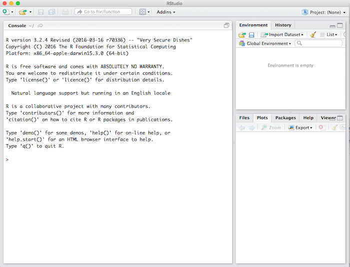
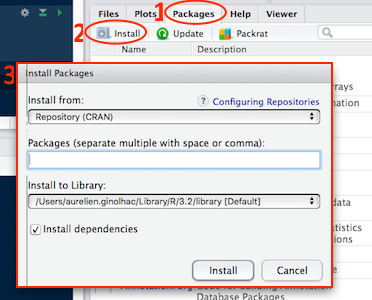
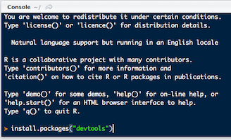

```{r setup, include=FALSE}
knitr::opts_chunk$set(echo = TRUE)
```

## Install R


`R` is available for free for Windows, GNU/Linux and MacOS.  
As for now, the latest version is `3.3.0`.

One common complain about `R` is the frequency of updates. This is true, but can be sorted out with a good **package manager**. Of note, major updates (`3.3`, early May 2016) are the only one forcing you to reinstall extra-packages and are released on a yearly basis.

### Windows

Visit the [download page](https://cloud.r-project.org/) and choose the corresponding installer for your platform.

To circumvent the lack of a package manager in Windows, it is possible to install the `R` library
`installr`. This package provides the `updateR()` function which takes care of updating your R installation
and migrates your installed libraries whenever a major `R` update is released. Recently, a package has been released which can also [help you](#reinstallr) in this task .

### MacOS

You can either browse to the [download page](https://cloud.r-project.org/) or better use the [Homebrew package manager](http://brew.sh/).

Once `homebrew` is installed, you can easily install/uninstall many programs with their dependencies and utilities. This implies to use the terminal. If you're not comfortable with the use of the terminal, ask me! It is worth it.
To install `R` using brew write in the following:

```{r, eval=FALSE}
brew install r
```

Updates for all your software can be easily performed and will be automatically handled by the following line:
```{r, eval=FALSE}
brew update; brew upgrade
```

### GNU/Linux

Any Linux distributions is bundled with a great package manager such as `dpkg` or `rpm`.
Visit the appropriate webpage for your distribution [here](http://cran.us.r-project.org/bin/linux/).

After you get the correct entry in your package manager, it should quite easy
```{r, eval=FALSE}
sudo apt-get install r-base r-base-dev
```

## Install Rstudio


Rstudio is an Integrated Development Editor, it wraps and interfaces `R` but, `R` needs to be installed first. The free-version contains everything you need.

Visit the [download page](https://www.rstudio.com/products/rstudio/download/) and
choose the corresponding installer for your platform. As for now, the latest version is `0.99.1172`.

## Open rstudio

They are 4 main panels in rstudio, but as the top-left is for scripting and by default missing, the layout should looks like



### install R packages from the Comprensive R Archive Network (CRAN)

On the bottom-right panel, 5 tabs are present:

- Files
- Plots
- Packages
- Help
- Viewer

Click on the `Packages` tab (1.) and select the select the `Install` button (2.). Type `dplyr, tidyr, ggplot2, ggrepel, devtools, broom, purrr, shiny, readr, readxl, d3heatmap, stringr, rmarkdown, knitr` in (3.)



It takes some time, usually 10 seconds up to 5 minutes for a single package depending on its size and compilation stage.

The packages can also be installed in the console (*i.e.* the bottom-left panel). The snapshot below shows you how to install `devtools` using the console:



Of note, `devtools` is handy when you want to install a development version, for example if a bug was fixed 
but the package not yet submitted to CRAN.

```{r, eval=FALSE}
devtools::install_github("hadley/dplyr")
```

#### A note about package updates

The complaint of very frequent updates might be legitimate as it could be cumbersome to maintain `R` up-to-date when you have many packages. Actually, it is as easy as:

```{r, eval=FALSE}
update.packages()
```

But, you should rather use the green `Update` button next to the `Install` (located in the `Packages` tab). The advantage is that you can check which package you would like to update and look at the actual changes by clicking on the `NEWS` link.

### install bioconductor packages

The [bioconductor](https://www.bioconductor.org/) resource will be detailed later, but to save time, copy / paste the following code into the consoleto install the necessary packages before the workshop:

```{r, eval=FALSE}
source("https://bioconductor.org/biocLite.R")
# to install the version 3.3 of the bioconductor installer.
biocLite(c("limma", "Biobase", "GEOquery"))
```

#### Package updates

There is no interface for bioconductor packages thus you need to run the following lines to update the packages (you will be asked if you want to update some / all):

```{r, eval=FALSE}
source("https://bioconductor.org/biocLite.R")
biocLite()
```

<a name="reinstallr"/>

### About packages and major version

A very recent package `reinstall` is doing a neat job looking at the installed packages and those you already used by parsing your your R files (`.R`, `.Rmd` etc.).

For example, after I upgraded to `3.3` I forgot some packages and can decide if I want to install them or not.

```{r, eval=FALSE}
#devtools::install_github("calligross/reinstallr")
library("reinstallr")
reinstallr(path = "~/Work/")
The following packages were found in your source files and can be installed from CRAN:
ggdendro openxlsx UpSetR pastecs wesanderson DNAcopy impute gplots directlabels DT GGally purrr ggpmisc VennDiagram blockcluster pheatmap gridSVG cowplot
Do you want to install them now?
y: Yes! Go ahed!
n: No, fortget it!
```

## Testing your installation

Copy / paste the code below and you should obtain the following plot.
```{r}
library("ggplot2")
library("tidyr")
library("ggrepel")
library("dplyr", warn.conflicts = FALSE)
theme_set(theme_bw(14))

mtcars %>%
  tibble::rownames_to_column(var = "car_name") %>%
  gather(key, value, c(drat, wt)) %>%
  ggplot(aes(x = value, y = mpg, colour = key))+
  geom_point()+
  geom_text_repel(aes(label = car_name))
```

If not, please [contact me](mailto:aurelien.ginolhac@uni.lu) with the error produced and the output of
```{r}
sessionInfo()
```
