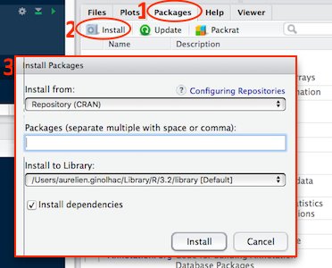

```{r setup, include=FALSE}
library(dplyr)
knitr::opts_chunk$set(echo = FALSE)
```

## R workshop | Day 1 - beginner

## Why learn R? {.build}

- Free!
- Packages
- Community


## Packages | as easy as `apt` and yes frequent updates


<div class="columns-2">
- CRAN, reliable many checks when submitting



- [GitHub](https://github.com/) using [devtools](https://github.com/hadley/devtools). Check [status](https://github.com/hadley/readr)

```{r, eval=FALSE}
# install.packages("devtools")
devtools::install_github("hadley/readr")
```

- [bioconductor](https://www.bioconductor.org/). Check [status](https://www.bioconductor.org/packages/release/bioc/html/limma.html)
```{r, eval=FALSE}
source("https://bioconductor.org/biocLite.R")
biocLite("limma")
```


</div>


# More and more packages


[source: Andrie de Vries](http://blog.revolutionanalytics.com/2016/04/cran-package-growth.html)

## Pipeline goal

[David Robinson](http://varianceexplained.org/) summarized the goal on his laptop


## Period of much suckiness

```{r, echo=FALSE}
#devtools::install_github("ijlyttle/vembedr")
library("vembedr")
suppressPackageStartupMessages(library("dplyr"))
embed_youtube("8SGif63VW6E")
```

## Period of much suckiness

> Whenever you’re learning a new tool, for a long time you’re going to suck...</br>
> But the good news is that it's typical, that’s something that happens to everyone, and it’s only temporary.</br>
> -- <cite>[Hadley Wickham][1]</cite>

[1]:https://youtu.be/8SGif63VW6E?t=4m12s
# Rstudio | Integrated Development Editor

## Layout, 4 panels


## Features

- Package management
- Console to run R, with syntax highligther
- Editor to work with scripts / markdown
- autocompletion using TAB
- Cheatsheets
- Keyboard shortcuts

# Chaining

## The pipe operator %>%

[magrittr by Stefan Milton Bache](https://cran.r-project.org/web/packages/magrittr/vignettes/magrittr.html)

Compare
```{r}
set.seed(124)
x <- rnorm(10)
mean(x)
round(mean(x), 3)
```

with
```{r}
set.seed(124)
rnorm(10) %>% mean %>% round(3)
```

Easy to read, natural from left to right.

Even better with **one** instruction per line and **indentation**
```{r}
set.seed(124)
rnorm(10) %>%
  mean %>%
  round(3)
```

# tidyr


## Concept


## Reading data


```{r}
library("readr")
df <- read_tsv("women.tsv", col_names = TRUE)
df
```

## Reading data 2/3


Using `Rstudio`, right bottom panel. Select the **folder**


## Reading data 2/3

When the **folder** is selected and its content displayed, tell `R` to use this location (alternative to `setwd(/path/to/location)`). Press the `More` menu and click on

`Set As Working Directory`


## Reading data 3/3


Using `Rstudio`, right top panel. Select directly your **file**


## Plotting

Overview

Switch from "wide" format to "long" format


See "tidy-data-playbook" by [Garrett Grolemund](http://garrettgman.github.io/tidying/)

Example


```{r}
head(iris, 5)
dim(iris)
```

```{r}
library("tidyr")
iris.melt <- gather(iris, petal, value, 3:4)
dim(iris.melt)
head(iris.melt, 5)
```

## Why is this useful?

```{r}
library("tidyr")
library("ggplot2")
iris %>%
  gather(petal, value, 3:4) %>%
  ggplot()+
  geom_boxplot(aes(x = Species, y = value, fill = petal))
```


## Barplots

```{r, out.width='450px', out.height='450px'}
library("tidyr")
gather(iris, leaf, value, 1:4) %>%
  ggplot()+
  geom_bar(aes(x = Species, y = value, fill = leaf), stat = "identity")
```

<a href = "http://rvisualization.com/ggplot2-overview-2/">

## Recommended reading

Excellent ressource about `R` (in French) by [Ewen Gallic](http://egallic.fr/Enseignement/R/m1_stat_eco_logiciel_R.pdf)

## Acknowledgments

Hadley
Ewen
Simon
David 
