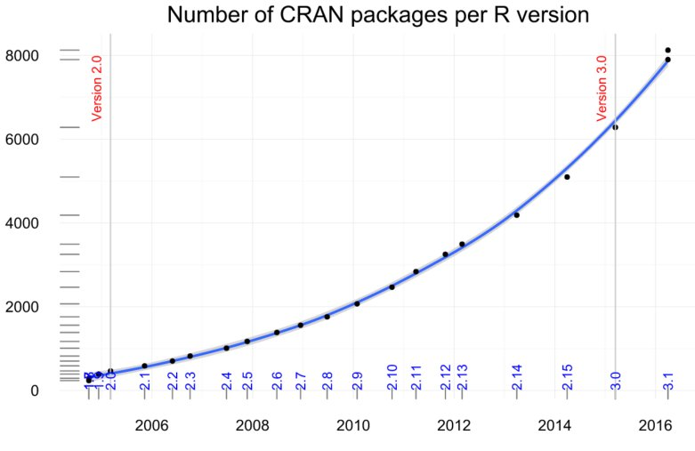
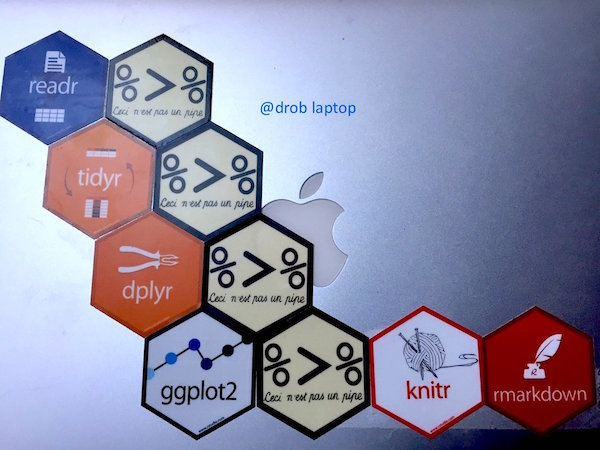
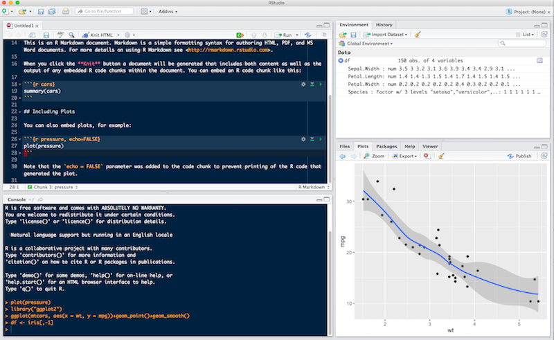

```{r setup, include=FALSE}
library(dplyr)
knitr::opts_chunk$set(echo = FALSE)
```

## R workshop | Day 1 - beginner

## Why learn R? {.build}

- Free!
- Packages
- Community


## Packages | as easy as `apt` and yes frequent updates


<div class="columns-2">
- CRAN, reliable many checks when submitting


- [GitHub](https://github.com/) using [devtools](https://github.com/hadley/devtools). Check [status](https://github.com/hadley/readr)

```{r, eval=FALSE}
# install.packages("devtools")
devtools::install_github("hadley/readr")
```

- [bioconductor](https://www.bioconductor.org/). Check [status](https://www.bioconductor.org/packages/release/bioc/html/limma.html)
```{r, eval=FALSE}
source("https://bioconductor.org/biocLite.R")
biocLite("limma")
```


</div>


# More and more packages



[source: Andrie de Vries](http://blog.revolutionanalytics.com/2016/04/cran-package-growth.html)

## Pipeline goal

[David Robinson](http://varianceexplained.org/) summarized the goal on his laptop



## Period of much suckiness

```{r, echo=FALSE}
#devtools::install_github("ijlyttle/vembedr")
library("vembedr")
suppressPackageStartupMessages(library("dplyr"))
embed_youtube("8SGif63VW6E")
```

## Period of much suckiness

> Whenever you’re learning a new tool, for a long time you’re going to suck...</br>
> But the good news is that it's typical, that’s something that happens to everyone, and it’s only temporary.</br>
> -- <cite>[Hadley Wickham][1]</cite>

[1]:https://youtu.be/8SGif63VW6E?t=4m12s
# Rstudio | Integrated Development Editor

## Layout, 4 panels



## Features

- Package management
- Console to run R, with syntax highligther
- Editor to work with scripts / markdown
- autocompletion using TAB
- Cheatsheets
- Keyboard shortcuts

# Chaining

## The pipe operator %>%

[magrittr by Stefan Milton Bache](https://cran.r-project.org/web/packages/magrittr/vignettes/magrittr.html)

Compare
```{r}
set.seed(124)
x <- rnorm(10)
mean(x)
round(mean(x), 3)
```

with
```{r}
set.seed(124)
rnorm(10) %>% mean %>% round(3)
```

Easy to read, natural from left to right.

Even better with **one** instruction per line and **indentation**
```{r}
set.seed(124)
rnorm(10) %>%
  mean %>%
  round(3)
```

# tidyr


## Concept


# dplyr

## dplyr - intro

There's a cheatsheet!


```{r}
with(mtcars, aggregate(mpg, list(cyl), mean))

library("dplyr") # library("dplyr", warn.conflicts = FALSE)
mtcars %>%
  group_by(cyl) %>%
  summarize(mean(mpg))
```

[source by Steve Simpson](http://data-steve.github.io/base-r-groupby-tapply-ave-by/)

## Web-based app to learn by practise

step-by-step tidying and manipulating data frames

https://exploratory.io/

## nycflights13

Convert data to a `tbl_df` so that it uses dplyr's nice `print` method. No need for `dim()`

```{r}
library("dplyr")
library("nycflights13")
flights <- tbl_df(flights)
flights
```

## glimpse


Use `glimpse` to few some values in each column.

```{r}
glimpse(flights)
```

## filter: inspect subsets of data

How many flights flew to La Guardia, NY in 2013? Expecting none...

```{r}
flights %>%
  filter(dest == "LGA")
```
base version (could be `subset`)
```{r}
flights[which(flights$dest == "LGA"), ]
```


## filter: multiple conditions

How many flights flew to Madison in first week of January?

```{r}
# Comma separated conditions are combined with '&'
flights %>%
  filter(dest == "MSN", month == 1, day <= 7)
```


## Question


> Commas in the filter statement are implicit `&` (and) operators.
Is there anything similar for `|` (or)?

Logical or statements are supported, but there's no shorthand.

```{r, eval = FALSE}
flights %>%
  filter(dest == "MSN" | dest == "ORD" | dest == "MDW")
```

For more complicated checks, try a set operation.

```{r, eval = FALSE}
flights %>%
  filter(is.element(dest, c("MSN", "ORD", "MDW")))
```


## arrange: sort columns

Sort by which airport they departed from in NYC, then year, month, day.

```{r}
flights %>%
  arrange(origin, year, month, day)
```


## desc: reverses sorting of a column

Find longest delayed flights to Madison.

```{r}
flights %>%
  filter(dest == "MSN") %>%
  arrange(desc(arr_delay))
```

## 

Find the most delayed (in minutes) flight in 2013

```{r}
flights %>%
  arrange(desc(arr_delay))
```

```{r}
1272 / 60
```

## select

Select the columns you want.

```{r}
flights %>%
  select(origin, year, month, day)
```

## select's helpers

`select` has many helper functions. See `?select`.

```{r}
flights %>%
  select(origin, year:day, starts_with("dep"))
```

## negative selecting

We can drop columns by "negating" the name. Since helpers
give us column names, we can negate them too.

```{r}
flights %>%
  select(-dest, -starts_with("arr"),
         -ends_with("time"))
```


## Recap: Verbs for inspecting data


* convert to a `tbl_df` - nice print method. Now in `[tibble](https://github.com/hadley/tibble)`
* `glimpse` - some of each column
* `filter` - subsetting
* `arrange` - sorting (`desc` to reverse the sort)
* `select` - picking (and omiting) columns


## rename

Rename columns with `rename(NewName = OldName)`. To keep the order
correct, read/remember the renaming `=` as "was".

```{r}
flights %>%
  rename(y = year, m = month, d = day)
```


# mutate

- How much departure delay did the flight make up for in the air?  
- Note that new variables can be used right away

```{r}
flights %>%
  mutate(
    gain = arr_delay - dep_delay,
    speed = (distance / air_time) * 60,
    gain_per_hour = gain / (air_time / 60)) %>%
  select(gain:gain_per_hour)
```


## Does gain could be explained by speed?


```{r}
library("ggplot2")
flights %>%
  mutate(gain = arr_delay - dep_delay,
    speed = (distance / air_time) * 60) %>%
  sample_n(10000) %>%
  ggplot(aes(x = gain, y = speed))+
  geom_point()
```

## mutate

to split time between hours and minutes

```{r}
flights %>%
  mutate(hours = dep_time %/% 100,
         minute = dep_time %% 100) %>%
  select(dep_time, hour, minute)
```


## group_by

Let's compute the average delay per month of flights to Madison.

Normally--in `aggregate`, `by` or plyr's `d*ply` functions--you
specify the grouping as an argument to the aggregation function.

```{r}
aggregate(dep_delay ~ month, flights, mean,
          subset = flights$dest == "MSN")
```


## group_by


In dplyr, grouping has its own action.  
Here, we `group_by` date. This data.frame is not tidy, but muti-grouping solve it. See the helpful reminder from `tbl_df` print method

```{r}
flights %>%
  filter(dest == "MSN") %>%
  group_by(month) %>%
  #Some values are missing, thus tell `mean` to remove them from the calculation.
  summarise(mean_dep_delay = mean(dep_delay, na.rm = TRUE))
```


## group_by (2)


Work per day

```{r}
by_day <- flights %>%
  group_by(year, month, day)
by_day
```

Note that one level (rigth most) is removed from grouping.


## summarise

Now we use `summarise` to compute (several) aggregate values within
each group (per day). `summarise` returns one row per group.

```{r}
by_day %>%
  summarise(
    flights = n(),
    avg_delay = mean(dep_delay, na.rm = TRUE),
    n_planes = n_distinct(tailnum))
```


## Exercice

* In average, how many flights a single plane is doing per day?

* plot the distribution, display the mean / median (`geom_vline()`)

* plot the average delay per day. Use `tidyr:unite` and `as.Date`

* which day should be avoided?

## Solution 1

```{r}
by_day %>%
  summarise(flights = n(),
            avg_delay = mean(dep_delay, na.rm = TRUE),
            n_planes = n_distinct(tailnum)) %>%
  mutate(avg_flights = flights / n_planes)
```

## Solution 2


```{r}
by_day %>%
  summarise(flights = n(),
            avg_delay = mean(dep_delay, na.rm = TRUE),
            n_planes = n_distinct(tailnum)) %>%
  mutate(avg_flights = flights / n_planes) %>%
  ggplot()+geom_density(aes(x = avg_flights))+
  geom_vline(aes(xintercept = mean(avg_flights)), colour = "red")+
  geom_vline(aes(xintercept = median(avg_flights)), colour = "blue")
```


## Solution 3

```{r, fig.align = 'center', fig.width = 12}
library("tidyr")
by_day %>%
  summarise(avg_delay = mean(dep_delay, na.rm = TRUE)) %>%
  ungroup() %>% 
  unite(date, -avg_delay, sep = "-") %>%
  mutate(date = as.Date(date)) %>%
  ggplot()+geom_bar(aes(x = date, y = avg_delay), stat = "identity")
```

## Solution 3


```{r, fig.align = 'center', fig.width = 12}
by_day %>%
  summarise(avg_delay = mean(dep_delay, na.rm = TRUE)) %>%
  arrange(desc(avg_delay))
```

What's wrong?

## Solution 3.2


Mind that `arrange` use grouping! (will change in version `0.4.5`)

```{r, fig.align = 'center', fig.width = 12}
by_day %>%
  summarise(avg_delay = mean(dep_delay, na.rm = TRUE)) %>%
  ungroup %>%
  arrange(desc(avg_delay))
```


## Exercice


* Find the destinations with the highest average arrival delay?
  - discard flights with missing data as arrival delay
  - count the number of flights per destination
  - discard results with less than 10 flights, mean not meaninful

## Solution


```{r}
flights %>%
  filter(!is.na(arr_delay)) %>%
  group_by(dest) %>%
  summarise(mean = mean(arr_delay),
            n = n()) %>%
  filter(n > 10) %>%
  arrange(desc(mean))
  
```


## Can see some spatial pattern for those delays?

First get the GPS coordinate of airports using the data frame `airports`

```{r}
airports
```

## join two data frames

```{r}
delays <- flights %>%
  filter(!is.na(arr_delay)) %>%
  group_by(dest) %>%
  summarise(mean = mean(arr_delay),
            n = n()) %>%
  filter(n > 10) %>%
  arrange(desc(mean)) %>%
  inner_join(airports, by = c("dest" = "faa")) # provide the equivalence since columns have a different name
```

We could have used **left_join** but 4 rows with a 3-letters acronym have no correspondance in the `airports` data frame. **inner_join** narrow down the lines that are present in both data frames.


## join types


Of note: **anti_join** can select rows which identifiers are **absent** in the second data frame.

plot on a map
====
class: small-code

```{r}
# preambule
# install.packages("maps")
library("maps")
```

```{r, fig.width = 16, align = 'center'}
# plot on the US map
delays %>%
  ggplot()+geom_point(aes(x = lon, y = lat, colour = mean), size = 3, alpha = 0.8)+
  scale_color_gradient2()+
  borders("state")
```

## plot on a map, with text


```{r, fig.width = 16, align = 'center'}
delays %>%
  ggplot()+geom_point(aes(x = lon, y = lat, colour = mean), size = 3, alpha = 0.8)+
  geom_text(aes(x = lon, y = lat, label = name), size = 3)+
  scale_color_gradient2()+theme_classic()+
  borders("state")
```

## plot on a map, with conditional text

```{r, fig.width = 16, align = 'center'}
delays %>%
  ggplot()+geom_point(aes(x = lon, y = lat, colour = mean), size = 3, alpha = 0.8)+
  geom_text(data = delays %>% filter(mean > 20),
            aes(x = lon, y = lat + 1, label = name), size = 3)+
  scale_color_gradient2()+theme_classic()+
  borders("state")
```

## tally / count

`tally` is a shortcut for counting number of items per group.

```{r}
flights %>%
  group_by(dest, month) %>%
  tally()
```

could sum over by multiple call of `tally`

`count` does the grouping for you
```{r}
flights %>%
  count(dest, month)
```


## That covers 80% of dplyr


- select
- filter
- arrange
- glimpse
- rename
- mutate
- group_by, ungroup
- summarise


## Other 20%


- assembly: bind_rows, bind_cols
- windows function, min_rank, dense_rank, cumsum
- column-wise operations: mutate_each, summarise_each
- join tables together: right_join, inner_join, full_join
- filtering joins: semi_join, anti_join
- do: arbitrary code on each chunk
- different types of tabular data (databases, data.tables)


## Reading data


```{r}
library("readr")
df <- read_tsv("women.tsv", col_names = TRUE)
df
```

## Reading data 2/3


Using `Rstudio`, right bottom panel. Select the **folder**


## Reading data 2/3

When the **folder** is selected and its content displayed, tell `R` to use this location (alternative to `setwd(/path/to/location)`). Press the `More` menu and click on

`Set As Working Directory`


## Reading data 3/3


Using `Rstudio`, right top panel. Select directly your **file**


## Coding style


`R` is rather flexible and permissive with its syntax. Howwver, being more strict tends to ease the debugging process.

See [Hadley's recommendations](http://adv-r.had.co.nz/Style.html)


## Plotting

Overview

Switch from "wide" format to "long" format


See "tidy-data-playbook" by [Garrett Grolemund](http://garrettgman.github.io/tidying/)

Example


```{r}
head(iris, 5)
dim(iris)
```

```{r}
library("tidyr")
iris.melt <- gather(iris, petal, value, 3:4)
dim(iris.melt)
head(iris.melt, 5)
```

## Why is this useful?

```{r}
library("tidyr")
iris %>%
  gather(petal, value, 3:4) %>%
  ggplot()+
  geom_boxplot(aes(x = Species, y = value, fill = petal))
```


## Barplots

```{r, out.width='450px', out.height='450px'}
library("tidyr")
gather(iris, leaf, value, 1:4) %>%
  ggplot()+
  geom_bar(aes(x = Species, y = value, fill = leaf), stat = "identity")
```

<a href = "http://rvisualization.com/ggplot2-overview-2/">

## Recommended reading

Reading
>* Excellent recent ressource about `R` by [Ewen Gallic](http://egallic.fr/Enseignement/R/m1_stat_eco_logiciel_R.pdf)

## Acknowledgments

Hadley
Ewen
Simon
David 
