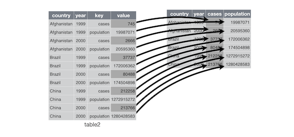

```{r setup, include=FALSE}
library(dplyr)
knitr::opts_chunk$set(echo = TRUE)
```

# R workshop | Day 1 - beginner

## Why learn R? {.build}

- Free!
- Packages
- Community
  + [`#rstats`](https://twitter.com/search?q=%23rstats) on twitter
  + [rbloggers](http://www.r-bloggers.com/)
  + [stackoverflow](http://stackoverflow.com/questions/tagged/r) many more tags `dplyr`, `ggplot2` etc


## Packages


<div class="columns-2">
- CRAN, reliable many checks when submitting


- [GitHub](https://github.com/) using [devtools](https://github.com/hadley/devtools). Check [status](https://github.com/hadley/readr)

```{r, eval=FALSE}
# install.packages("devtools")
devtools::install_github("hadley/readr")
```

- [bioconductor](https://www.bioconductor.org/). Check [status](https://www.bioconductor.org/packages/release/bioc/html/limma.html)
```{r, eval=FALSE}
source("https://bioconductor.org/biocLite.R")
biocLite("limma")
```


## More and more packages


[source: Andrie de Vries](http://blog.revolutionanalytics.com/2016/04/cran-package-growth.html)

## Pipeline goal

[David Robinson](http://varianceexplained.org/) summarized the goal on his laptop


## Period of much suckiness

```{r, echo=FALSE}
#devtools::install_github("ijlyttle/vembedr")
library("vembedr")
suppressPackageStartupMessages(library("dplyr"))
embed_youtube("8SGif63VW6E", query = list(start = secs("4m12s")))
```

## Period of much suckiness

> Whenever you’re learning a new tool, for a long time you’re going to suck...</br>
> But the good news is that it's typical, that’s something that happens to everyone, and it’s only temporary.</br>
> -- <cite>[Hadley Wickham][1]</cite>

[1]:https://youtu.be/8SGif63VW6E?t=4m12s

## R data structures

`vector`, `lists`, `data.frame`, `matrix`, `array` etc

Lists are objects that could contain anything

```{r}
list(a = 1:3, b = c("hello", "bye"), data = head(iris, 2))
```


## Focus on `data.frame` 

which are `lists` where all columns have **equal** length

```{r}
class(iris)
class(unclass(iris))
```

Actually, better to use `tbl_df`

# Rstudio | Integrated Development Editor

## Layout, 4 panels


## Features

- Package management (also for building)
- Console to run `R`, with syntax highligther
- Editor to work with scripts / markdown
- autocompletion using TAB
- Cheatsheets
- Keyboard shortcuts


Cmd + Enter: sends line or selection from the editor to the console and runs it.
(Ctrl + Enter on a PC)

↑: in the console browse previous commands

## Update options

Recommended in the [r4ds](http://r4ds.had.co.nz/introduction.html#prerequisites)
To get a clean environment at start-up


## Projects

Solve most issues with working directories, get rid of `setwd()`


# Chaining

## The pipe operator %>%

[magrittr by Stefan Milton Bache](https://cran.r-project.org/web/packages/magrittr/vignettes/magrittr.html)

Compare
```{r}
set.seed(124)
x <- rnorm(10)
mean(x)
round(mean(x), 3)
```

with
```{r}
set.seed(124)
rnorm(10) %>% mean %>% round(3)
```

## Easier to read

natural from left to right.

Even better with **one** instruction per line and **indentation**
```{r}
set.seed(124)
rnorm(10) %>%
  mean %>%
  round(3)
```

# Tidying data | tidyr


## Definitions

+ **Variable**: A quantity, quality, or property that you can measure.
+ **Observation**: A set of values that display the relationship between variables. To be an observation, values need to be measured under similar conditions, usually measured on the same observational unit at the same time.
+ **Value**: The state of a variable that you observe when you measure it.

[source: Garret Grolemund](http://garrettgman.github.io/tidying/)

## Rules

1. Each variable is in its own column
2. Each observation is in its own row
3. Each value is in its own cell


## Convert Long / wide format

The wide format is generally untidy _but_ found in the majority of datasets





## Demo with iris

```{r}
head(iris, 3)
```

gather

```{r}
library("tidyr")
iris_melt <- iris %>%
  tibble::rownames_to_column() %>%
  dplyr::tbl_df() %>%
  gather(flower, measure, contains("al"))
iris_melt
```

##

spread

```{r}
iris_melt %>%
  spread(flower, measure)
```

## Separate / Unite

```{r, echo=FALSE}
df <- data_frame(year = c(2015, 2014, 2014),
                 month = c(11, 2, 4),
                 day = c(23, 1, 30),
                 value = c("high", "low", "low"))
```

unite
```{r}
df %>%
  unite(date, c(year, month, day), sep = "-") -> df_unite
```

separate, use **quotes** since not refering to objects
```{r}
df_unite %>%
  separate(date, c("year", "month", "day"))
```


# Reading data | readr


## read_tsv

Guess column types and give **warnings**.

```{r}
library("readr")
soft <- read_tsv("data/GDS5079.soft", skip = 42, na = "null")
```

Viewer utility
```{r, eval=FALSE}
View(soft)
```

## Easier: import file utility


Using `Rstudio`, right top panel. Select directly your **file**.
This actually uses **readr**


# Plotting | ggplot2

[overview](http://rvisualization.com/ggplot2-overview-2/)

## Why tidy is useful?

```{r}
library("tidyr")
library("ggplot2")
iris %>%
  gather(flower, measure, 1:4) %>%
  ggplot()+
  geom_boxplot(aes(x = Species, y = measure, fill = flower))
```

## Scatterplots

```{r, out.width='450px', out.height='450px'}
iris %>%
  ggplot(aes(x = Sepal.Length, y = Sepal.Width, colour = Species))+
  geom_point()+
  geom_smooth(method = "lm", se = FALSE)+
  xlab("Length")+
  ylab("Width")+
  ggtitle("Sepal")
```

## More aesthetics

```{r}
iris %>%
  ggplot(aes(x = Sepal.Length, y = Sepal.Width,
             size = Petal.Length / Petal.Width,
             colour = Species))+
  geom_point()+
  scale_size_area("Petal ratio Length / Width")+
  #scale_colour_brewer(palette = 1, type = "qual")+
  scale_colour_manual(values = c("blue", "red", "orange"))+
  xlab("Sepal.Length")+
  ylab("Sepal.Width")
```

## in / out aesthetics

```{r}
iris %>%
  ggplot(aes(x = Sepal.Length, y = Sepal.Width))+
  geom_point(aes(colour = Species))
```

```{r}
iris %>%
  ggplot(aes(x = Sepal.Length, y = Sepal.Width))+
  geom_point(aes(colour = "Species"))
```

```{r}
iris %>%
  ggplot(aes(x = Sepal.Length, y = Sepal.Width))+
  geom_point(colour = "red")
```

## Barplots

```{r, out.width='450px', out.height='450px'}
iris_melt %>%
  ggplot()+
  geom_bar(aes(x = Species, y = measure, fill = flower), stat = "identity")
```

## Density and faceting

transparency using the `alpha` parameter
```{r}
iris_melt %>%
  ggplot()+
  geom_density(aes(x = measure, fill = Species, colour = Species), alpha = 0.6)+
  facet_wrap(~ flower, scale = "free")+
  theme_bw()
```

## facetting

transparency using the `alpha` parameter
```{r}
iris_melt %>%
  ggplot()+
  geom_density(aes(x = measure, fill = Species, colour = Species), alpha = 0.6)+
  facet_grid(Species ~ flower, scale = "free")+
  theme_bw()
```

## theme

```{r}
  ggplot(iris, aes(x = Sepal.Length, y = Sepal.Width))+
  geom_point(aes(colour = Species))+
  theme_light()
```

```{r}
  ggplot(iris, aes(x = Sepal.Length, y = Sepal.Width))+
  geom_point(aes(colour = Species))+
  theme_classic()
```


```{r}
  ggplot(iris, aes(x = Sepal.Length, y = Sepal.Width))+
  geom_point(aes(colour = Species))+
  theme_void()
```

```{r}
  ggplot(iris, aes(x = Sepal.Length, y = Sepal.Width))+
  geom_point(aes(colour = Species))+
  theme_dark()
```

## Recommended reading

- [R for data science](http://r4ds.had.co.nz) by Hadley & Garrett
  + [reading data](http://r4ds.had.co.nz/data-import.html)
  + [tidy data](http://r4ds.had.co.nz/tidy-data.html)
  + [plotting](http://r4ds.had.co.nz/data-visualisation.html)
- [ggplot2 layer by layer](http://rpubs.com/hadley/ggplot2-layers) by Hadley
- Excellent ressource about `R` (in French) 
[Ewen Gallic](http://egallic.fr/Enseignement/R/m1_stat_eco_logiciel_R.pdf) by Ewen Gallic

## Acknowledgments

* Hadley Wickham
* Garrett Grolemund
* Jenny Bryan
* Ewen Gallic
* Simon
* David Robinson
* Eric Koncina
