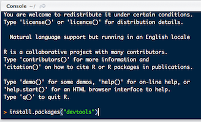

```{r setup, include=FALSE}
knitr::opts_chunk$set(echo = FALSE)
```

## R workshop | Day 1


## Why learn R? {.build}

- Free!
- Packages
- Community


## Packages | as easy as `apt` and yes frequent updates


<div class="columns-2">
- CRAN, reliable many checks when submitting


- [GitHub](https://github.com/) using [devtools](https://github.com/hadley/devtools). Check [status](https://github.com/hadley/readr)
```{r, eval=FALSE}
# install.packages("devtools")
devtools::install_github("hadley/readr")
```

- [bioconductor](https://www.bioconductor.org/). Check [status](https://www.bioconductor.org/packages/release/bioc/html/limma.html)
```{r, eval=FALSE}
source("https://bioconductor.org/biocLite.R")
biocLite("limma")
```



</div>


# More and more packages


[source: Andrie de Vries](http://blog.revolutionanalytics.com/2016/04/cran-package-growth.html)

## Pipeline goal

[David Robinson](http://varianceexplained.org/) summarized the goal on his laptop


## Period of much suckiness

> Whenever you’re learning a new tool, for a long time you’re going to suck...</br>
> But the good news is that is typical, that’s something that happens to everyone, and it’s only temporary.</br>
> -- <cite>[Hadley Wickham][1]</cite>

[1]:https://youtu.be/8SGif63VW6E?t=4m12s


# Rstudio | Integrated Development Editor

## Layout, 4 panels


## Features

- Package management
- Console to run R, with syntax highligther
- Editor to work with scripts / markdown
- autocompletion using TAB
- Cheatsheets
- Keyboard shortcuts


# Chaining

Compare
```{r}
set.seed(1234)
x <- rnorm(10)
mean(x)
round(mean(x), 3)
```

with
```{r}
set.seed(1234)
rnorm(10) %>% mean %>% round(3)
```

# dplyr

```{r}
with(mtcars, aggregate(mpg, list(cyl), mean))

library(dplyr)
mtcars %>% group_by(cyl) %>% summarize(mean(mpg))
```

[source by Steve Simpson](http://data-steve.github.io/base-r-groupby-tapply-ave-by/)

