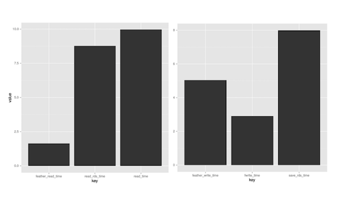

```{r setup, include=FALSE}
knitr::opts_chunk$set(echo = TRUE, cache = TRUE)
```

## R workshop | Day 2 - advanced

## Modern R

[David Robinson](http://varianceexplained.org/) summarized the goal on his laptop

```{r, echo=FALSE, out.width='55%'}
knitr::include_graphics("img/drob_r_pipeline_600.jpg")
```

see also what Karl Broman is recommanding for [people who learnt R a while ago](http://kbroman.org/hipsteR/)

## reading data

Recently the project `feather` for python / R was achieved by Hadley Wickham and  Wes McKinney 

Column structure and binary storage. Column types are preserved

```{r, echo=FALSE, out.width='60%'}

```

- [Rstudio blog](https://blog.rstudio.org/2016/03/29/feather/)
- [performance benchmark](https://blog.dominodatalab.com/the-r-data-i-o-shootout/)
- [github repo](https://github.com/wesm/feather)

## Managing multiple models

Tutorial based on the great conference by [Hadley Wickham][1]


[1]:https://www.youtube.com/watch?v=rz3_FDVt9eg


## Functional programming and nested data_frames {.codefont}

Using `purrr` and `tidyr`. Hadley takes every part of `R` and _cleans_ it up.

`purrr` revisits the `apply` family in a consistent way.
`tidyr::nest` nests list in `tibble::data_frame` to keep related things together.

## For loops emphasis objects and not actions {.codefont}

compare (notice `seq_along` instead of `1:length(mtcars)`)
```{r}
means <- vector("double", ncol(mtcars))
for (i in seq_along(mtcars)) {
  means[i] <- mean(mtcars[[i]])
}
means
```

and
```{r}
library("purrr")
map_dbl(mtcars, mean)
```

## Nested map

```{r}
library("purrr")
library("dplyr", warn.conflicts = FALSE)
funs <- list(mean = mean, median = median, sd = sd)
funs %>%
  map(~ mtcars %>% map_dbl(.x))
```

## Keep related things together

Linear model _per_ country
```{r}
library("gapminder")
library("tidyr")
by_country_lm <- gapminder %>%
  mutate(year1950 = year - 1950) %>%
  group_by(continent, country) %>%
  nest() %>%
  mutate(model = map(data, ~ lm(lifeExp ~ year1950, data = .x)))
```

## Tidying model coefficients

Use broom to extract from `lm()` in neat data frames:
- coefficients estimates: **slope** and **intercept**
- $r^2$ 
- residuals

```{r}
library("broom")
models <- by_country_lm %>%
  mutate(glance  = map(model, glance),
         rsq     = glance %>% map_dbl("r.squared"),
         tidy    = map(model, tidy),
         augment = map(model, augment))
```

# Exploratory plots

## Does linear models fit all countries?

```{r, out.width='60%'}
library("ggplot2")
theme_set(theme_bw(14))
models %>%
  ggplot(aes(x = rsq, y = reorder(country, rsq)))+
  geom_point(aes(colour = continent))+
  theme(axis.text.y = element_text(size = 6))
```

## focus on non-linear trends

```{r, cache=FALSE}
models %>%
  filter(rsq < 0.55) %>%
  unnest(data) %>%
  ggplot(aes(x = year, y = lifeExp))+
  geom_line(aes(colour = continent))+
  facet_wrap(~ country)
```

## shiny - code

```{r, cache=FALSE, eval=FALSE}
library("shiny")
inputPanel(
  selectInput("country", "Select Country", levels(models$country))
)
output$rsq <- renderPlot({
  models %>%
  filter(country == input$country) %>%
  unnest(data) %>%
  ggplot(aes(x = year, y = lifeExp))+
  geom_line(aes(colour = continent))
})
renderUI({
 plotOutput("rsq", height = "400", width = "600")
})
```

## shiny

```{r, cache=FALSE, echo=FALSE}
library("shiny")
inputPanel(
  selectInput("country", "Select Country", levels(models$country))
)
output$country <- renderPlot({
  models %>%
  filter(country == input$country) %>%
  unnest(data) %>%
  ggplot(aes(x = year, y = lifeExp))+
  geom_line(aes(colour = continent))
})
renderUI({
 plotOutput("country", height = "400", width = "600")
})
```


## shiny - rsquare

```{r, cache=FALSE, echo=FALSE}
library("shiny")
inputPanel(
  sliderInput("rsq", "Select rsquared", min = 0, max = 1, 
              value = c(0, 0.2), dragRange = TRUE)
)
output$rsq <- renderPlot({
  models %>%
  filter(rsq >= input$rsq[1], rsq <= input$rsq[2]) %>%
  unnest(data) %>%
  ggplot(aes(x = year, y = lifeExp))+
  geom_line(aes(colour = continent))+
  facet_wrap(~ country)
})
renderUI({
 plotOutput("rsq", height = "400", width = "600")
})
```

## All in all

```{r,out.width='70%'}
models %>%
  unnest(tidy) %>%
  select(continent, country, rsq, term, estimate) %>%
  #filter(continent != "Africa") %>%
  spread(term, estimate) %>%
  ggplot(aes(x = `(Intercept)`, y = year1950))+
  geom_point(aes(colour = continent, size = rsq))+
  geom_smooth(se = FALSE)+
  scale_size_area()+
  labs(x = "Life expectancy (1950)",
       y = "Yearly improvement")
```


