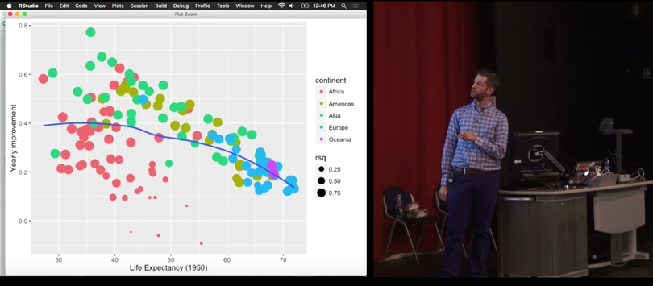

```{r setup, include=FALSE}
knitr::opts_chunk$set(echo = TRUE)
```

## R workshop | Day 2 - advanced


## Modern R

[David Robinson](http://varianceexplained.org/) summarized the goal on his laptop


see also what Karl Broman is recommanding for [people who learnt R a while ago](http://kbroman.org/hipsteR/)

## Managing multiple models

Tutorial based on the great conference by [Hadley Wickham][1]



[1]:https://www.youtube.com/watch?v=rz3_FDVt9eg


## Functional programming and nested data_frames

Using `purrr` and `tidyr`. Hadley takes every part of `R` and _clean_ it up.

`purrr` revisit the `apply` family in a consistent way.
`tidyr::nest` nest list in `tibble::data_frame` to keep related things together.

## For loops emphasis objects and not actions

compare (notice `seq_along` instead of `1:length(mtcars)`)
```{r}
means <- vector("double", ncol(mtcars))
for (i in seq_along(mtcars)) {
  means[i] <- mean(mtcars[[i]])
}
means
```

and
```{r}
library("purrr")
map_dbl(mtcars, mean)
```


## Nested map

```{r}
library("purrr")
library("dplyr", warn.conflicts = FALSE)
funs <- list(mean = mean, median = median, sd = sd)
funs %>%
  map(~ mtcars %>% map_dbl(.x))
```


## Keep related things together

Linear model _per_ country
```{r}
library("gapminder")
library("tidyr")
by_country_lm <- gapminder %>%
  mutate(year1950 = year - 1950) %>%
  group_by(continent, country) %>%
  nest() %>%
  mutate(model = map(data, ~ lm(lifeExp ~ year1950, data = .x)))
```

## Tidying model coefficients

From `lm()` extract in neat data frames using broom:
- coefficients estimates: **slope** and **intercept**
- $r^2$ 
- residuals

```{r}
library("broom")
models <- by_country_lm %>%
  mutate(glance  = map(model, glance),
         rsq     = glance %>% map_dbl("r.squared"),
         tidy    = map(model, tidy),
         augment = map(model, augment))
```

## Exploratory plots

```{r}
library("ggplot2")
theme_set(theme_bw(14))
models %>%
  ggplot(aes(x = rsq, y = reorder(country, rsq)))+
  geom_point(aes(colour = continent))+
  theme(axis.text.y = element_text(size = 6))
```


