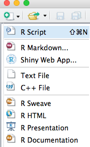

## Project - set-up

- Create a new project in a meaningful folder name on your computer such as
`R_workshop/day1-beginner`

using the project manager utility, top-right of the rstudio window.


- Create a new folder `data` using bottom-right panel > **Files** tab > _New Folder_ button 


- Create a new script to write and execute your `R` commands.
top-left panel > **Create** icon > _New Script_ entry



## Reading data

Download this simple tab-separated file
http://lsru.github.io/r_workshop/data/women.tsv

and save it inside the folder `R_workshop/day1-beginner/data`.

Remember your current active rstudio project should be `day1-beginner`

load it, now the root is the project, so all paths are relative to it
```{r, eval=FALSE}
library("readr")
df <- read_tsv("data/women.tsv", col_names = TRUE)
df
```

Thanks to `readr` the object `df` is already a _tibble diff_ [rstudio blog: tibble](https://blog.rstudio.org/2016/03/24/tibble-1-0-0/)

